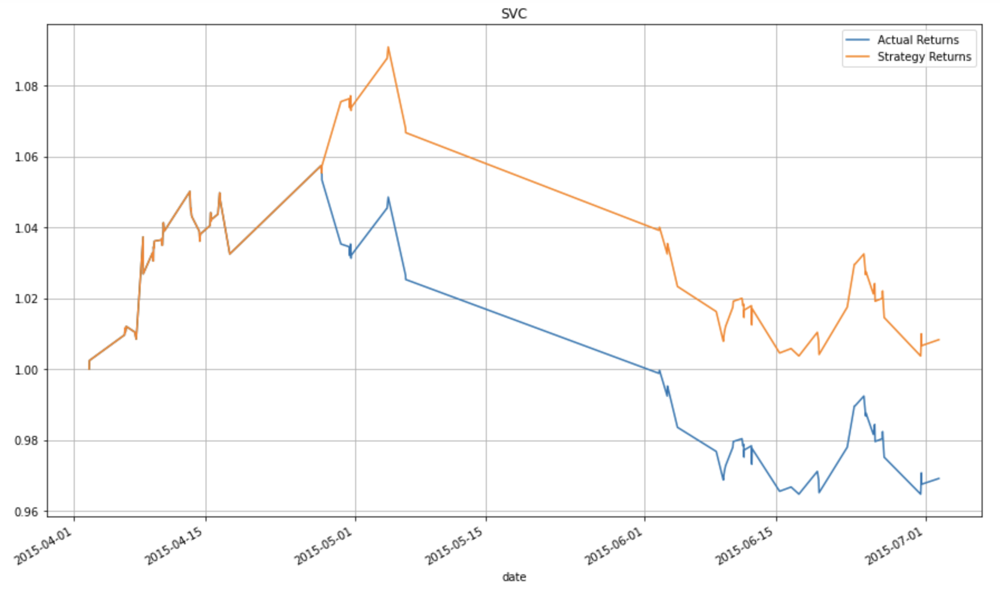
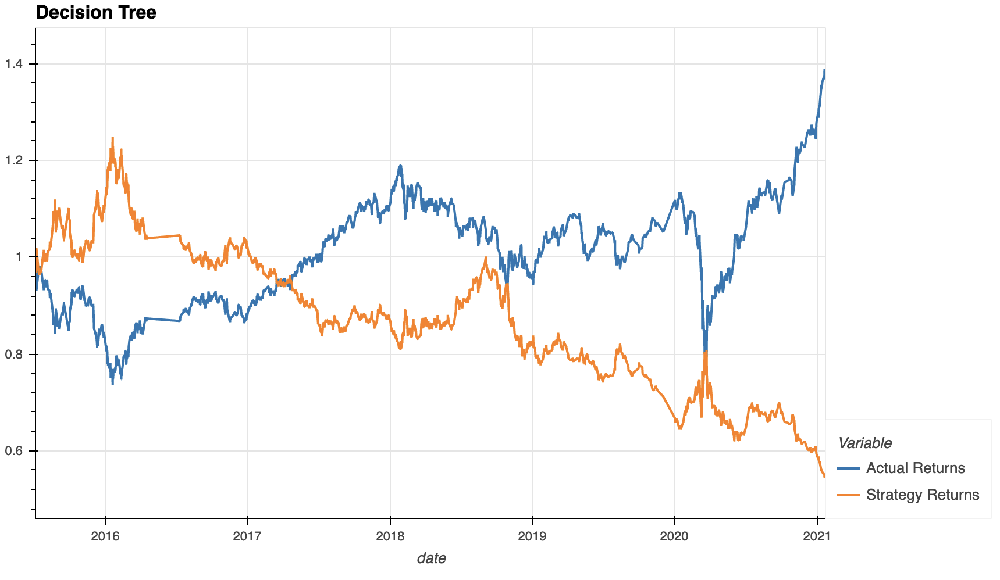
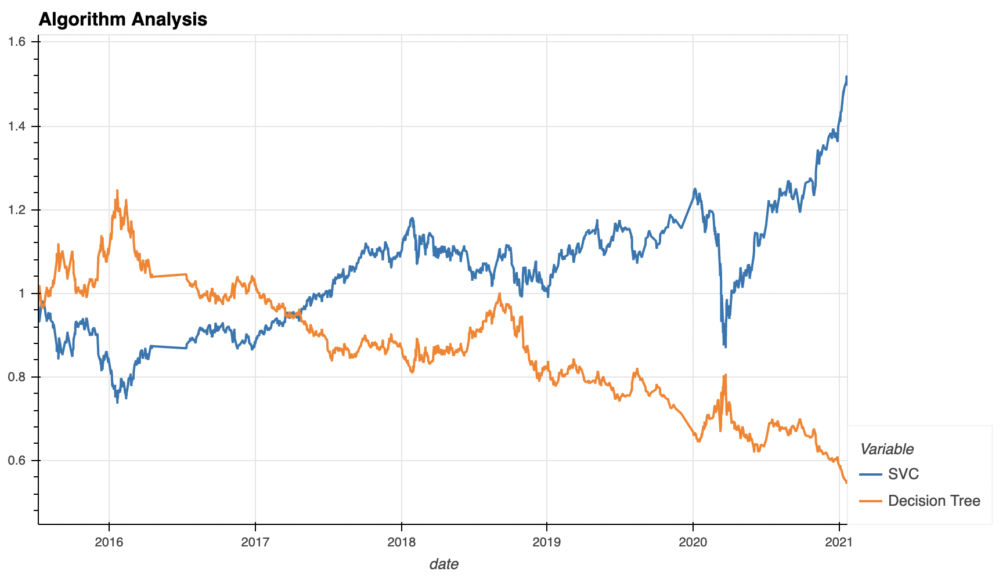

# Machine Learning-Based Algorithmic Trading

This notebook consists of analyzing the cumulative return effectiveness of two different machine learning algorithms within the realm of algorithmic trading. 


---

## Technologies

Before attempting to execute any Python code in `machine_learning_trading_bot.ipynb`, it is imperative that your development environment holds the following modules:

[pandas](https://pandas.pydata.org/pandas-docs/stable/) - Data analysis module.

[numpy](https://numpy.org/install/) - Numerical computing module.

[pathlib](https://docs.python.org/3/library/pathlib.html) - Object-oriented filesystem path library.

[hvplot](https://hvplot.holoviz.org/) - Interactive plotting module. 

[matplotlib](https://matplotlib.org/) - Plotting module. 

[sklearn](https://sklearn.org/) - Machine learning module.

---

## Installation Guide

With your _Python 3.7+_ environment, run the following commands via CLI:

```
import pandas as pd
import numpy as np
from pathlib import Path
import hvplot.pandas
import matplotlib.pyplot as plt
from sklearn import svm
from sklearn.preprocessing import StandardScaler
from pandas.tseries.offsets import DateOffset
from sklearn.metrics import classification_report
from sklearn import tree
```

---

## Examples (Baseline Model)





---

## Examples (Updated Model)

---

## Conclusion

Within this notebook, two machine learning algorithms (_SVC_ classifier model and _Decision Tree_) were carried out for the purpose of evaluating their effectiveness within the realm of algorithmic trading. For the sake of consistency and effective analysis, the long and short trading windows retained their size across both algorithms and the training / testing data remained identical. The plot below showcases the cumulative returns of both the _SVC_ classifier model and _Decision Tree_ model across the same time period. From this, we can conclude that the trading strategy based off of the _SVC_ model proves to be much more effective in generating cumulative returns for the OHLVC dataset. 



---

## Usage

1. Clone repository onto your personal machine. 

2. Open _Jupyter Lab_ or _Jupyter Notebook_ via _Anaconda Navigator_ and navigate to the directory in which the file `machine_learning_trading_bot.ipynb` is present. _All relevant code for this repository will be executed via Jupyter Notebook and no output will be printed to the command line_. Ensure that all relevant dependencies and _Python_ modules are installed (see __Technologies__ and __Installation Guide__ for more details) before attempting to execute code within _Jupyter Notebook_; otherwise, you will receive multiple interpreter errors! 

3. With the notebook open, start at the very first cell reading "__Machine Learning Trading Bot__" (a cell will be active when a rectangular border is surrounding the area in question). Run each cell in sequential order. _It is vital that all cells are ran in sequential order or your notebook will generate compiler errors_!. 

---

## Contributors

New development created by Aaron C. Montano. **Code from 'Initial commit.' commit originates from UC Berkeley Extension and I do not claim original ownership nor scholarship**.

---

## License

Software tool available for public use. 
